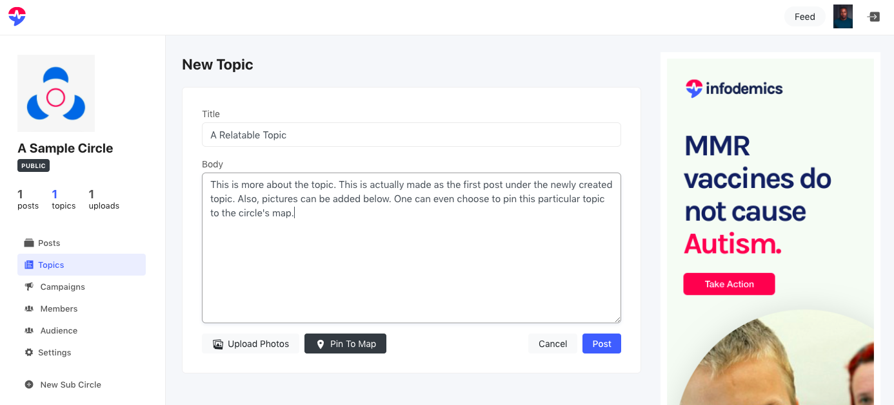
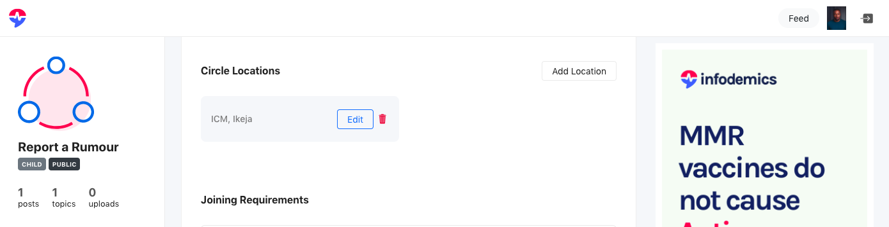

# Infodemics Manual


This is a brief manual to using the [Infodemics Risk Communication Platform](https://infodemics.com).

## Contents

1. [Introduction](#introduction)
	* [Signup](#sign-up)
	* [Log in](#log-in)
	* [Forgot password](#forgot-password)
	* [Setup](#setup)
	* [Navbar](#navbar)

2. [Profile](#profile)
	* [Posts](#posts)
	* [Topics](#topics)
	* [Campaigns*](#campaigns)
	* [Settings](#settings)
		* Change my email
		* Change my password
		* Change my profile image
	* [Create a Circle](#create-a-circle)

3. [Feed](#feed)
	* [Search](#search)
	* [Index](#index)
	* [Menu](#menu)
	* [Content](#content)

4. [Circles](#circles)
	* [Creating a circle](#creating-a-circle)
	* [Joining a circle](#joining-a-circle)
		* Added by administrator
		* Filling join requirements
	* [Circle audiences](#circle-audiences)
	* [Circle settings](#circle-settings)
	* [Creating a topic](#creating-a-topic)
	* [Making a post](#making-a-post)
	* [Sending SMS](#sending-sms)
	* [Sending Email](#sending-email)
	* [Maps and locations](#maps-and-locations)

4. [Applications](#applications)
	* [Publishing Circles](#publishing-circles)
	* [Building Forms](#building-forms)
		* Filling forms on Infodemics
		* Filling forms via Typeform
	* [Disbursements*](#disbursements)

5. [FAQ](#faq)
	* [Pricing](#pricing)
	* [Ownership](#ownership)

6. [To Do](#to-do)

7. [Use Cases](#use-cases)

## Introduction
Infodemics (infodemics.com) is a risk communication platform which works on the premise that the use of social circles in the dissemination of information makes for the most efficient and effective communication.

At Infodemics, we believe that the management of epidemics first of all begins with a definition of a location context. This is important to determine:

* where resources are to be channeled to

* what languages communication would be expressed in

* which possible collaboration is possible:
	* with the location based government
	* non-government parties and others which go into a successful risk communication plan

We then organise the risk communication effort into what we term **circles**. A circle is a group of people, sharing a common characteristic, skill or function which coordinate the risk communication effort.

Finally, we then communicate risk using our inbuilt media channels which include SMS, email, Interactive Voice Response (IVR) among others.

This manual will help users get acquainted with the application and help navigate easily.

### Sign up


The **Log In**  button at the top right hand corner will let you log in or sign up to Infodemics. There are two ways you can sign up to use Infodemics:

* provide a valid phone number and email
* signup using Google, Twitter or Facebook accounts

Please note that when providing phone numbers, you would have to select your country and then your phone number with out the leading "0". For instance, a Nigerian with a typical *080x* number would choose Nigeria (+234) and then enter their number as *80x*.

### Log in

Log in is either using your registered phone number of the use of your Google, Twitter or Facebook accounts.

### Forgot Password

By selecting the *Forgot Password?* link while trying to log in, you will be presented with the password recovery window.


We have password recovery options available for accounts which have registered with a valid phone number. A code will be sent to you to use in the recovery process.

### Setup

Once you have successfully signed up, Infodemics will present you with a few recommended circles you can join. This is purely optional but it is a good way to begin to be exposed to the many features of the platform.


### Navbar
You can always quickly navigate using the navigation bar (navbar). 


The Infodemics icon on the left will always take you to the feed. The other icons on the right are:

* a button to take you to your activity feed
* a profile icon to take you to your profile and
* an exit button to log out of the application

Note that these might look slightly different if you use Infodemics on a mobile phone.

## Profile

The Infodemics user profile shows a summary of the user activities with quick links to do other user specific activities.


### Posts

A reverse chronological (most recent to oldest) view of all the user's posts can be seen by clicking the *Posts* link in the side menu. The circles where these posts have been made can be clicked to go directly to the circle. One can also click the topic link to quickly add an additional post.


Also note that posts are limited to 235 characters and up to 4 images can be added to any post.

### Topics

All conversation on Infodemics carried out through posts can only exist under defined topics. The idea is to make sure each conversation is of a known theme to make conversation clearer among larger teams.

Clicking the *Topics* link under a profile will show topics that have been created by that profile.


Note that for circles for which you are an administrator you can also quickly make a post under the topic.

### Campaigns

This feature will be explained in the near future.


### Settings

The profile settings let you change your profile image (avatar), your email or your password.


#### Change my email

You can change the email associated with your profile. This is especially useful if your organisation is one of those granted special priviledges.

If you had signed up with a personal email, you can use this to change to your official email so you can use all the features available to your institution.

#### Change my password

Changing your password is as easy as entering the old password and the new desired password.

#### Change my profile image

Having a profile image lends some credibility to your profile. Easily change it in your profile settings.

### Create a circle

Creating a circle is explained in more detail [here](#creating-a-circle).

## Feed

The Infodemics activity feed brings together all of a profile's activity into one view. This is usually where one begins their day from.


### Search

One important function when someone is viewing the activity feed is search. At the navbar (top left hand side), there is a search box which will query every public circle and show the results.

Note that you can always search partial words or expressions.


### Index

On the side menu, one can go to the list or index of all public circles. This is the Infodemics Circle Index. Clicking on any circle will take you directly to that selected circle.


### Menu

The side menu of the feed view shows some key shortcuts to the use profile, check-ins, the app gallery and besides the public and recommended circles, all circles that have been created, administered or joined by the user.

### Content

The activity feed content is self descriptive. It is a reverse chronological feed (most recent to older). Images, if they exist in the post, will also be shown with other links to jump directly to the circle or topic the post was made in.


## Circles

As previously defined, collaboration on the Infodemics platform are done in circle contexts. Think of circles as containing members which create topics and posts while communicating with an audience.

### Creating a circle

Creating a circle is done easily from the profile page. Click the *New Circle* link on the side menu to get started.


A circle is described with a title, its type: either public or private and its join requirements.

A public circle will be listed on the Infodemics index, visible when users search for it and be open to any user to join. A private circle is only accessible to the invited. We shall discuss that shortly.

A circle at least a single join requirement (though you can have as many as you desire). A join requirement is information that must be provided by users before they become members of a circle. Think of it as showing identification to enter a room.

Note that you can create a sub circle. This is only possible in a single level. It means that, for now, you cannot create a circle under a circle which is also under a circle.

### Joining a circle

One can join a circle by being added by the administrator or by filling the join requirements.

#### Added by administrator

As an administrator, you can navigate to the circle members and add a new member. You would need to know the phone number of the profile to be added. The new member can be added as an administrator or a regular member.


#### Filling join requirements

The more common way to invite an Infodemics user to a circle is to share with them the URL of the circle. Once you give them a link to the circle, they can just fill in the already set requirements and be admitted into the circle as a regular member. You can assign administrator or other roles under the circle settings.

Note that leaving the circle is as easy as clicking the *Leave Circle* button.


### Circle audiences

As you may have surmised, members of a circle are inidividuals who have an Infodemics profile. There are instances where there is a need to communicate with individuals who are not signed up on Infodemics. We use a circle's audience for this purpose.


It is as easy as navigating to the circle *Audience* link. Here we can see existing audiences or create new ones. Currently, audiences are of two types: SMS and email. 

Createing a new audience is as easy as specifying its type: phone or email, a description and then the actual list of phone numbers or email (never the two at the same time).

Phone numbers must be entered in the full manner, separated by commas and no space in between e.g

```
+2348021234567,+2348034567890
```

Emails follow the same format:

```
user@provider.com,profile@website.com
```

### Circle settings

You may want to define a circle join requirements in more details: providing options for users to choose from. This can be done easily as shown.


The same circle settings allows you to change a circle's name, the associated image, its type: public or private among other things. Here also, you can remove administrators or similar.

You many note that the ability to remove circle member is under construction.

### Creating a topic

Creating a topic under a circle is as easy as clicking the *Topics* link and then the *New Topic* button.


The topic is entered with the accompanying new post. This is actually made as the first post under the newly created topic. Also, pictures can be added below.



One can even choose to pin this particular topic to the circle's map. Move the red location pin to your desired location while using the zoom icons (+ and -) for accuracy.


### Making a post

Making a new post is also easy. First of all, use the *Posts* link on the side menu of the circle to see the recent posts. They will all be shown with their associated topics (see the highlighted area).


Clicking the topic will bring up a window to enter a new post. Note that a post can not be more than 235 characters though one can also add pictures.


### Sending SMS

As you may have noticed, as an administrator of a circle, you can send any posts of length less than 235 characters as SMS.


The SMS can be sent to selected members of a circle or any of its audiences and any other numbers you wish (properly formatted).


You will notice that if you decide to add any other numbers just before messages are sent, you can also save those as a new audience for the next time.


Details on pricing can be found [here](#pricing).

### Sending Email

Sending emails are just like the case of SMS. Here, there are no length restrictions as any post can be sent as an email to members of a circle with valid emails, email audiences or any such email you choose to enter.

The major difference between sending SMS and emails is that the emails sent will have the topic as the subject line One should therefore make certain that this is descriptive enough.

Details on pricing can be found [here](#pricing).

### Maps and locations

You may have noticed the map associated with a circle and the locations pinned on it. These are usually associated with certain topics or posts (clicking the balloon on the map will take you directly).


You can modify these locations from the associated posts (notice the *Change Pin Location* button).



You can also see all locations and modify them (even removing them totally) from the circle settings. 

## Applications

Infodemics is so easy to use that one can easily forget it is a one stop risk communication platform.

There are also many features which enable you to extend Infodemics. These include publishing your circles so that they are available to the public as a form of blog (The Infodemics Blog is a prime example!), collecting input from the public through forms, questionnaires and (in the future) polls.

### Publishing Circles
A circle can be published by its owner or any of its administrators. The purpose of publishing a circle is to make its topics available to be read by the public as they would a blog post.


To do so, navigate to the circle settings and enter a vanity URL and then publish "Publicly". After doing so, topics made in your circle will then be visible to whoever goes to the URL you just published. An example of this is the Infodemics blog which is at [https://infodemics.com/v/blog](https://infodemics.com/v/blog). You can then broadcast your the generated link on your social media accounts, banners and so forth.

### Building Forms
As you will soon find out, there are several scenarios where members of the public need to fill a form, providing data or some other information for use within an Infodemics circle. Infodemics currently has two ways to do this: either on the Infodemics platform or via a third party service: [Typeform](https://typeform.com).

#### Building forms on Infodemics
An Infodemics circle already has the form ability built in to its join requirements (see [*Creating a Circle*](#creating-a-circle)). Once the appropriate fields to be filled in are set up, one needs to then publish the parent circle "for Input" and all its public child circles will be available to be filled by members of the public.


Note that you can always share the vanity URL (link) of the parent circle so that people can click on it to fill your form and automatically join the circle!

#### Building forms via Typeform
There are instances where a more finer approach to forms is needed: optional fields, image or video uploads or other custom offerings like receiving payments and the like. For this cases, we have setup an Infodemics - Typeform integration.

You only need contact us at [support@infodemics.com](mailto:support@infodemics.com) so we can build the form together to fit your requirements and then we can publish it "via Typeform" on Infodemics, providing the unique url for the form so people can fill it from Infodemics.

The responses to the form can then be provided to you in a manner you desire: on demand, daily schedule or automatically as they are submitted.

### Disbursements

This feature is under construction.


## FAQ

We have tried to answer our frequently asked questions (FAQ) below.

### Pricing

*How much do you charge for Infodemics?*

Infodemics is currently free for all non-commercial uses. All SMS and emails are sent free of charge when you use the Infodemics platform non-commercially at the moment.

### Ownership

*Circles, members and their audiences belong to who?*

Infodemics owns its created circles and audiences. Circles and audiences you create on Infodemics are also currently owned by you. We also advice that you use the circle availability (public or private) to enforce access.

## To Do

There are several features being worked on by the Infodemics team. These, besides regular user interface and user experience updates, include:

* expanding on our channel offerings: IVR, USSD and similar
* expanding on campaigns and collaborative tools
* more robust circle and role management
* providing more robust analytics

## Use Cases
The Infodemics use cases will look at various contexts of the use of the application such as:

* location and geo-targeted activities

* use of media channels

* collaboration


